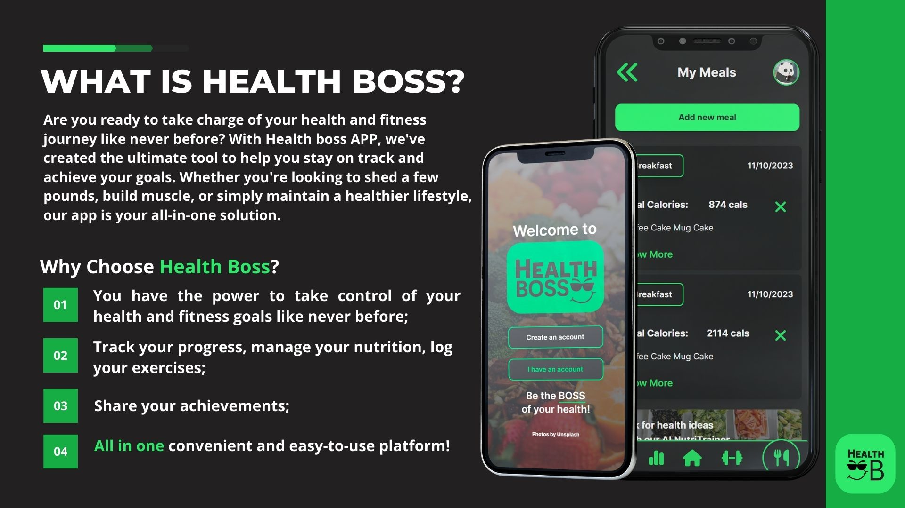

# Health Boss APP 😎

"Be the boss of your health"



[Our figma 🎨](https://www.figma.com/file/LpdEaufepRQpsLyV9Ha7MR/Health-Boss-High-fidelity?type=design&node-id=0%3A1&mode=design&t=EYnKt974bz0HLfry-1)

### ⚠️ Installation Guide ⚠️

```bash
cd health-boss
```

- Run "npm install" to install all dependencies

```bash
npm i
```

Prisma command for the genarate the scheema

- You need to have node and MongoDB installed
- You need version Nextjs v3 and prisma client 5.4.1
- Create an .env file in your project root folder and add the variables.

```{
DATABASE_URL="PUT YOUR URL FROM MONGODB"
NEXTAUTH_SECRET="Scret Next Auth Key"
NEXTAUTH_URL="http://localhost:3002" < Live like that for locally>
}
```

```bash
npx prisma db push
```

Start the server

```bash
npm run dev
```

## Frontend tech

- Nextjs v3
- Tailwinds
- Typescript
- E2E Cypress test
- Cloudinary
  <br>

## Backend tech

- Prisma
- MongoDB
- Typescript
- Unit test jest
- Integration test Cypress
- Next Auth
  <br>

## Meet the team 😎

[Cintia Siqueira](https://github.com/ciisiq)<br>
[Daria Mousavi](https://github.com/dariaMousavi)<br>
[Eduard Draghiciu](https://github.com/Eduardcodes)<br>
[Edward Pau](https://github.com/edpau)<br>

## Documentations 📑

- [Prisma](https://www.prisma.io/docs)<br>
- [Next Auth](https://next-auth.js.org/getting-started/introduction)<br>
- [MongoDB](https://www.mongodb.com/docs/)<br>
- [Tailwinds](https://tailwindcss.com/docs/installation)<br>
- [DaisyUI](https://daisyui.com/components/)<br>
- [Nextjs](https://nextjs.org/docs)<br>
- [Vercel](https://vercel.com/docs)<br>
- [Cypress](https://docs.cypress.io/guides/references/configuration)<br>
- [JWT](https://jwt.io/introduction)<br>
- [API Edaman](https://developer.edamam.com/food-database-api-docs)<br>
- [TypeScript](https://www.typescriptlang.org/docs/)<br>
- [FontAwesome](https://fontawesome.com/docs)<br>
- [Download NodeJs](https://nodejs.org/en/download)<br>
